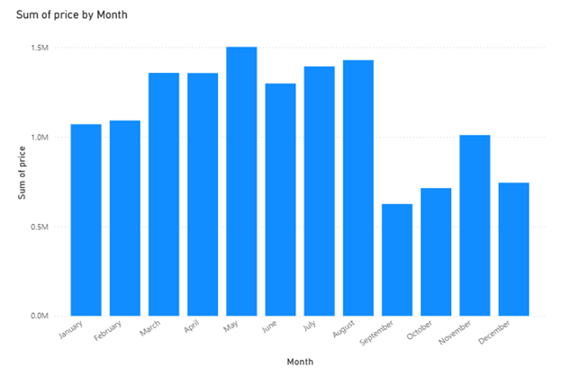
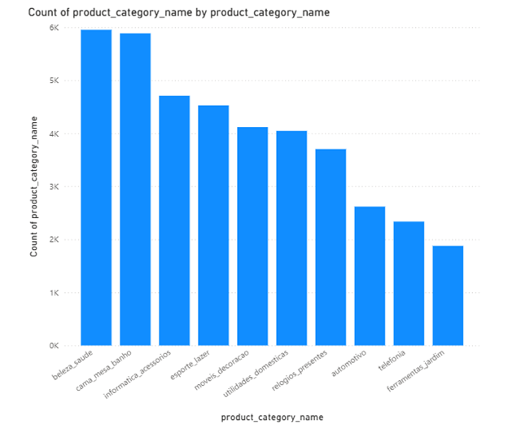
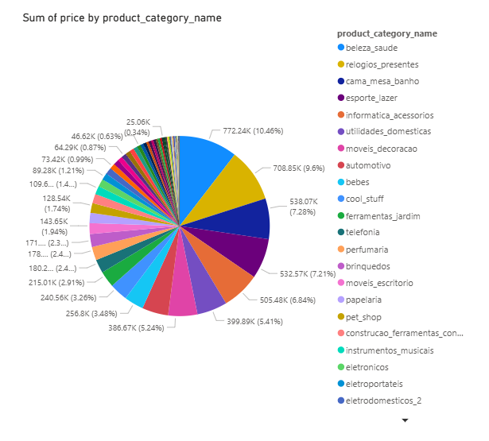

# Brazilian E-commerce Big Data Project

This project simulates a real-world Big Data pipeline built on top of the [Brazilian E-commerce dataset (Olist)](https://www.kaggle.com/datasets/olistbr/brazilian-ecommerce).  
It is divided into 2 roles:

🛠 **Data Engineer (on Ubuntu VM)**: 
- Ingest raw data into HDFS
- Clean and transform data using Apache Spark
- Load transformed data into PostgreSQL

📊 **Data Analyst (on Windows)**: 
- Visualize using Power BI

## 🧱 Project Architecture

```bash
Raw CSV (local) 
    ↓
[HDFS - Data Lake] 
    ↓ (clean & transform)
[Spark] 
    ↓ 
[PostgreSQL - Data Warehouse] 
    ↓ 
[Power BI - Visualization]
```

## 📂 Project Structure
```bash
├── Data/               - Dataset files
├── Notebooks/          - Jupyter Notebooks for processing (PySpark)
├── Visualizations/     - Charts and dashboards (Power BI)
└── README.md           
```
## ⚙️ ETL Pipeline (Data Engineer)
- Data ingested from CSV → HDFS
- Cleaned & transformed using Apache Spark
- Loaded to PostgreSQL data warehouse
## 📊 Dashboard (Data Analyst)
- Visualization with Power BI Desktop

## 📈 Visualizations
1. Monthly Revenue in 2018



2. Top 10 Best-Selling Products



3. Revenue by Product



## 🛠️ Tools and Technologies
- HDFS
- Apache Spark (PySpark)
- PostgreSQL
- Power BI
- Jupyter Notebook
- Linux
- Git
